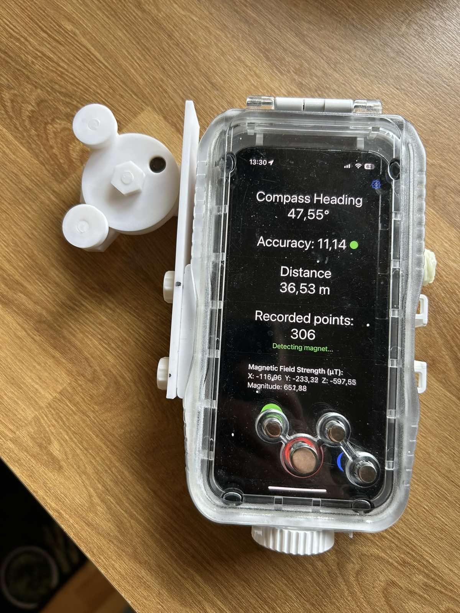
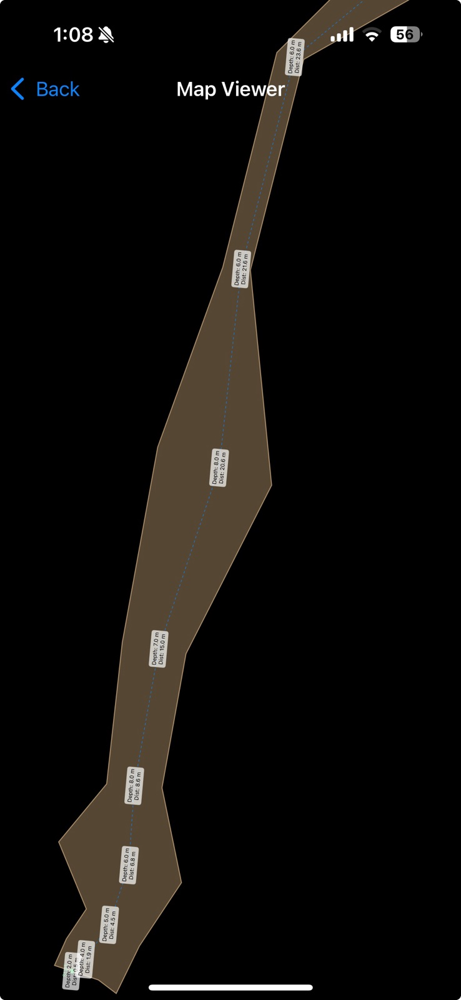

# CaveDiveMap 🏊‍♂️🗺️

An iOS app for surveying underwater caves. A 3D-printed measuring wheel rides on the guideline and the iPhone, inside a dive housing, counts its rotations to measure distance, reads the compass for heading, and builds a live map of the line as you go.

<p align="center">
  
  
</p>

## 🌊 Overview

CaveDiveMap is made for cave divers who want a line survey without a slate full of numbers. The phone sits in a waterproof case with a custom 3D-printed wheel device attached. The wheel clamps around the cave line and turns as you swim; the app converts rotations into distance and records a heading with every rotation. At each tie-off you save a station with depth and passage dimensions. After the dive you export the survey as CSV or as a Therion centreline.

The app also has a separate, experimental camera-based mode (visual-inertial odometry) that records a 3D point cloud of the passage without any wheel.

## 🎯 How It Works

### Wheel detection methods

The wheel can be read in three ways. You choose one in **Settings → Detection Method**, and you can switch mid-survey without losing the distance.

1. **Magnetic** (default)
   - A small magnet in the wheel passes the iPhone's magnetometer once per rotation.
   - The app counts one rotation each time the field rises above a high threshold and falls back below a low one.
   - Works on the total field strength or on a single axis (X, Y or Z), selectable in Settings.
   - Needs a one-time calibration: **Start Calibration (10s)** and keep the wheel turning. Thresholds are placed at 35 % and 65 % of the measured signal swing. If the wheel was not turning, calibration fails with a message and keeps the old thresholds.

2. **Magnetic (PCA Phase)**
   - Follows the magnet's field in 3D instead of watching for peaks. The app finds the plane the field rotates in, tracks the rotation angle within it, and counts one rotation per full 360° of accumulated angle.
   - Because the angle is signed, a wheel rocking back and forth on a taut line cancels out instead of adding distance. A full turn counts in either direction, so it does not matter which way round the device sits on the line.
   - Uses the gyroscope and accelerometer to ignore the signal while the phone itself is being swung around.
   - Less sensitive to how the phone is oriented than the threshold method. Has its own 10 s calibration for minimum signal strength, and a live signal-strength and quality readout in Settings.

3. **Optical**
   - Uses the rear camera (the ultra-wide / macro camera when available) and the flashlight. A wheel with an opening blocks and unblocks the light once per rotation, and the app counts the brightness changes.
   - Useful where the magnetic environment is difficult.
   - Flashlight brightness is adjustable in Settings (0–100 %).
   - Calibration meters the camera exposure on the turning wheel, locks it, and stores it together with the brightness thresholds, so the same exposure is used on every dive. **Recalibrate if you change the flashlight brightness.**
   - **Settings → Show Detection Preview** shows the live brightness against the thresholds.
   - Requires the 3D-printed optical encoder wheel (in development for the DiveVolk case).

Distance is always `rotations × wheel circumference`. Set your **wheel diameter** in Settings and check it against a measured length of line.

### Visual-Inertial Odometry (experimental)

Opened with the orange camera button. This mode does not use the wheel at all.

- Uses Apple's ARKit (camera + IMU) to track the phone's path and to collect a sparse 3D point cloud of the passage walls.
- Records a centreline with distance and depth relative to the start, and marks tracking gaps so that positions either side of a gap are never joined up.
- **SET N** ties the scan to the compass so the exported cloud carries a real bearing. **ADD COMMENT** attaches a note to the current position.
- Autosaves every minute, and saves a `.ply` point cloud to the app's folder in the Files app when you press **STOP**.
- Tested in dry caves with good accuracy. Underwater it needs good visibility and a light source fixed to the housing, so the lighting stays constant from the phone's point of view.
- The result is LiDAR-like, with fewer points.

### Measurement process

1. At each tie-off, align the phone with the line and press the **green button** to save a station.
   - The compass heading is taken at the moment you press the button. If compass accuracy is poor the app shows **"Move to calibrate"** and will not open the save screen — rotate the phone around until the heading indicator turns green.
   - Distance counting is paused while the save screen or the map is open, so finish entering data before moving on.
2. On the save screen, enter **depth** and the passage dimensions **left / right / up / down** (LRUD).
   - Read depth from your dive computer. For LRUD use a sonar range finder, or estimate by eye in smaller caves.
   - **+ / −**: tap changes the value by 1 m, press and hold changes it by 10 m. The **blue button** cycles through Depth → Left → Right → Up → Down. Depth starts from the previous station's value.
   - **Depth can be negative.** Where the line leaves the water in an air chamber and is tied off above the surface, tap **−** past zero (the screen shows "Above water"). This lets a sump survey link correctly to a dry-cave survey. Holding **−** stops at 0 so you cannot overshoot by accident.
3. Clamp the wheel around the guideline and swim the shot. The app measures the length of line and logs a heading on every rotation.
4. At the next tie-off, detach the wheel and rotate the phone around to keep the compass calibrated.
5. Repeat: align with the line, save a station, clamp, swim.

### Live map

The **blue map button** shows the survey so far, north-up (magnetic):

- Centreline with shot length and depth at each station, and passage walls drawn from the left/right values.
- Shot lengths are corrected for depth change, so a sloping line is drawn at its true horizontal length.
- Pinch to zoom, twist to rotate (the compass rose follows), drag to pan.
- **Edit Walls** lets you drag wall points and long-press to add new ones.
- A few firm knocks on the housing return to the main screen, for when the touch screen is awkward underwater.
- Export buttons for CSV and Therion are in the bottom-left corner.

### Data collection and export

- **Automatic points**: recorded on every wheel rotation (distance and heading).
- **Manual points**: stations saved by the diver at tie-offs (distance, heading, depth, LRUD).
- **CSV export**: every record, via the iOS share sheet.
- **Therion export**: a ready-to-compile centreline file (`SavedData.thr`) in `diving` style, built from the manual stations. It carries today's date and LRUD for both ends of every shot. Set the **survey title** and **team** in **Settings → Therion Export**.
- **Reset**: press and hold the red button for 3 seconds. The app first writes a timestamped CSV backup to its folder in the Files app, then clears the survey.
- Survey data is written to disk as it is recorded, so it survives an app crash or a restart mid-dive, and distance carries on from where it stopped.

### Other settings

- **Button Customization**: resize and reposition every button on the main and save screens to suit your housing.
- **PointCloud to Map**: load a `.ply` from the VIO mode, view it in 3D or as plan and profile, and export a PDF map.

## 🛠️ Hardware Requirements

### 3D-Printed Device

The app requires a custom 3D-printed device that attaches to a waterproof iPhone case. The device includes:
- Measurement wheel with magnet cavity
- Guideline clamp mechanism
- Mount for iPhone dive case

**Design Goals:**
- Fully 3D-printable for easy fabrication anywhere
- No springs, screws, or special hardware required
- Simple assembly and maintenance

The STL/3MF files and the Fusion 360 source are in [`3d_print_stl/`](3d_print_stl).

### Non-Printed Components

Minimal additional parts needed:
- **Rubber band**: For tensioning the clamp on the guideline
- **Small magnet**: 8mm diameter (commonly available at hardware stores)
  - *Note: Larger magnets can be accommodated by drilling out the cavity*
  - *(optional) a small ring of bike inner tube over the main wheel to improve traction on the line*

## 📦 Downloads & Resources

- **App Store**: [CaveDiveMap on App Store](https://apps.apple.com/app/cavedivemap/id6743342160)
- **3D Print Files**: [Thingiverse - Measurement Wheel Device](https://www.thingiverse.com/thing:6950056), or the [`3d_print_stl/`](3d_print_stl) folder in this repository
- **Compatible Dive Case**: Waterproof iPhone cases (e.g., generic underwater housings). Tested with: DiveVolk Seatouch 4

## 🖼️ Screenshots

### App in Run Mode


### Live Map View


## 🤿 Usage Scenario

1. Attach the 3D-printed device to your waterproof iPhone case
2. Set the wheel diameter in Settings
3. Choose a detection method (Magnetic, Magnetic PCA or Optical) and run its calibration with the wheel turning
4. At the first tie-off, align with the line and save a station
5. Clamp the device onto the guideline and swim; the app records distance and heading automatically
6. Save a station at every tie-off, with depth and LRUD
7. Check the live map whenever you like
8. After the dive, export CSV or Therion from the map screen

## 🧰 Desktop tool

[`tools/PointCloud2Map.py`](tools/PointCloud2Map.py) renders a plan map from a VIO point cloud on a computer:

```
pip install numpy matplotlib shapely scipy plyfile
python tools/PointCloud2Map.py pointcloud.ply --out cave_map.pdf
```

`--alpha` controls how tightly the wall outline hugs the points (default 0.6).

## 🔧 Technical Details

- **Platform**: iOS 18 or later (iPhone)
- **Language**: Swift / SwiftUI
- **Sensors Used**:
  - Magnetometer (magnetic and PCA detection)
  - Gyroscope and accelerometer (PCA motion rejection, knock-to-go-back)
  - Camera and flashlight (optical detection)
  - Camera and IMU via ARKit (visual-inertial odometry)
  - Compass (heading)
  - Manual depth and LRUD input via UI
- **Data Formats**: CSV, Therion centreline, PLY point cloud, PDF map
- **Building from source**: open `cave-mapper.xcodeproj` in Xcode and run on a device. The sensors are not available in the simulator.

## 📝 License

Free and open source, use everything for anything you want. No license whatsoever.

## 🙏 Acknowledgments

This project demonstrates the power of accessible technology for specialized scientific applications in cave diving and underwater exploration.

---

**⚠️ Safety Notice**: This app is a survey tool and should not be used as a primary navigation device. Always follow proper cave diving safety protocols and use redundant navigation methods.
