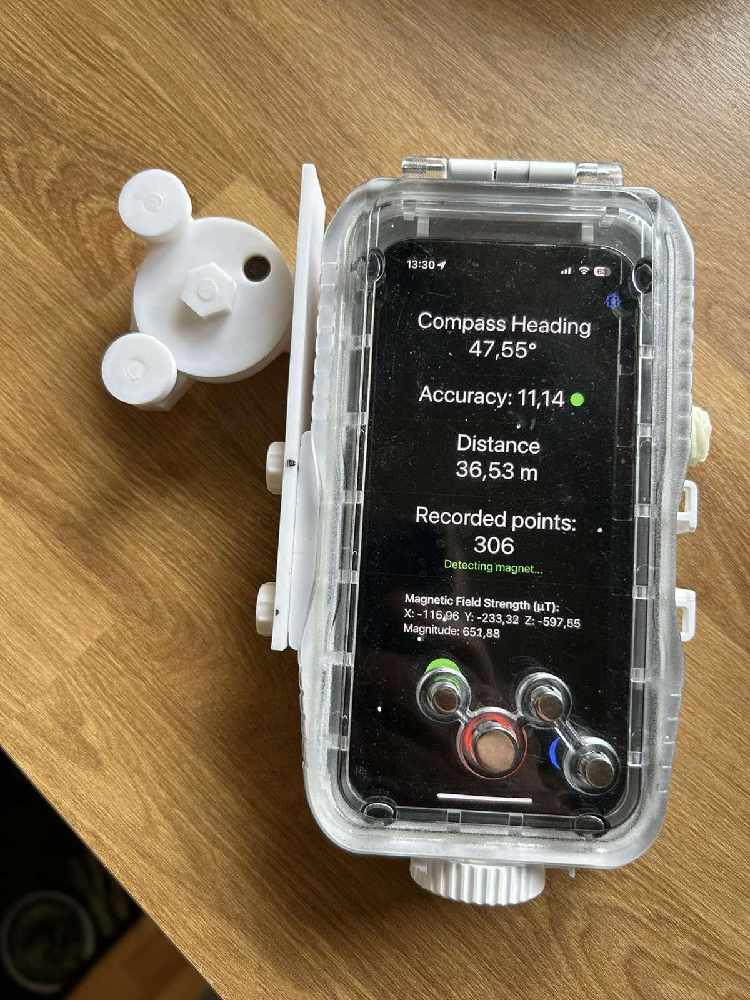
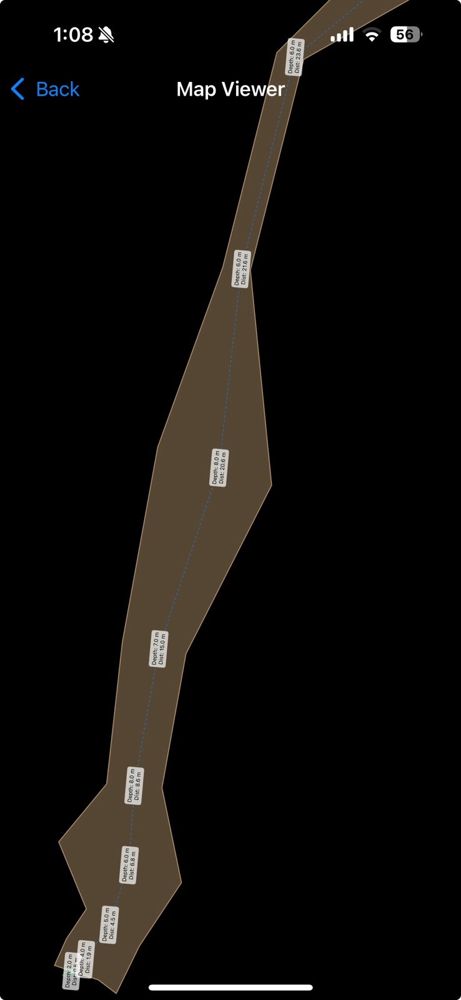

# CaveDiveMap 🏊‍♂️🗺️

An iOS app for underwater cave surveying that uses magnetometer-based distance measurement with a 3D-printed encoder wheel device.

  
  

## 🌊 Overview

CaveDiveMap is designed for cave divers who need to accurately survey underwater caves. The app works with a waterproof iPhone case and a custom 3D-printed measurement wheel that tracks distance traveled along cave diving lines.

## 🎯 How It Works

### Detection Methods

The app supports two methods for detecting wheel rotations:

1. **Magnetic Detection** (Primary)
   - Uses the iPhone's magnetometer to detect a magnet embedded in the wheel
   - Detects peak magnetic field values as the wheel rotates
   - Calculates distance based on wheel circumference

2. **Optical Detection** (Alternative)
   - Uses the iPhone's macro camera and flashlight
   - Detects brightness changes from wheel openings
   - Provides redundancy in challenging magnetic environments
   - Requires 3d printed visual encoder wheel ( currently in development for DiveVolk case )
   
3. **Visual Innertial Odometry** ( Experimental )
   - Uses Apple's ARkit to createa  3d point cloud and centerline using camera and IMU data.
   - Tested in dry caves with good accuracy. Needs good visibility underwater.
   - Requires light source to be fixed to dive case to provide consistent lighting from the point of view of the phone.
   - Creates lidar like ( less points ) .ply pointcloud representing 3d scan of the cave profile.

### Measurement Process

1. At each tieoff the phone is aligned with the line and manual data point is saved ( green button ).
   - The diver can set depth and LRUD data manually from the save screen.
   - Depth you can see from your dive computer. LRUD you can use sonar range finder or eyeball it for smaller caves.
2. The measurement wheel is then clamped around the cave diving guideline
3. As the diver moves forward, the wheel rotates freely and the app measures distance of the current shot/section of line
4. At the next tieoff you detach the wheel and rotate the phone around to calibrate the compass.
5. Repeat the steps again for the next shot of line ( align with line, save manual point, clamp and measure distance)

### Data Collection

- **Automatic Points**: Recorded on each wheel rotation
- **Manual Points**: Added by diver at tie-off locations 
- **Export**: CSV format and Therion format via iOS share options
- **Live Map**: Real-time visualization during the dive

## 🛠️ Hardware Requirements

### 3D-Printed Device

The app requires a custom 3D-printed device that attaches to a waterproof iPhone case. The device includes:
- Measurement wheel with magnet cavity
- Guideline clamp mechanism
- Mount for iPhone dive case

**Design Goals:**
- Fully 3D-printable for easy fabrication anywhere
- No springs, screws, or special hardware required
- Simple assembly and maintenance

### Non-Printed Components

Minimal additional parts needed:
- **Rubber band**: For tensioning the clamp on the guideline
- **Small magnet**: 8mm diameter (commonly available at hardware stores)
  - *Note: Larger magnets can be accommodated by drilling out the cavity*
  - *(optional) a small ring of bike inner tube over the main wheel to improve tracktion on the line*

## 📦 Downloads & Resources

- **App Store**: [CaveDiveMap on App Store](https://apps.apple.com/app/cavedivemap/id6743342160)
- **3D Print Files**: [Thingiverse - Measurement Wheel Device](https://www.thingiverse.com/thing:6950056)
- **Compatible Dive Case**: Waterproof iPhone cases (e.g., generic underwater housings). Tested with: DiveVolk Seatouch 4 

## 🖼️ Screenshots

### App in Run Mode

### Live Map View

## 🔧 Technical Details

- **Platform**: iOS (iPhone)
- **Language**: Swift
- **Sensors Used**: 
  - Magnetometer (for magnetic detection)
  - Camera (for optical detection)
  - Compass (for heading)
  - Manual depth input via UI
- **Data Format**: CSV export, Therion

## 🤿 Usage Scenario

1. Attach the 3D-printed device to your waterproof iPhone case
2. Calibrate the wheel diameter in the app
3. Choose detection method (magnetic or optical)
4. Clamp the device onto the cave guideline
5. Start survey mode
6. The app automatically records data as you move along the line
7. Add manual waypoints at tie-offs or key locations
8. Export survey data after the dive

## 📝 License

Free and open source, use everything for anything you want. No license whatsoever. 

## 🙏 Acknowledgments

This project demonstrates the power of accessible technology for specialized scientific applications in cave diving and underwater exploration.

---

**⚠️ Safety Notice**: This app is a survey tool and should not be used as a primary navigation device. Always follow proper cave diving safety protocols and use redundant navigation methods.
